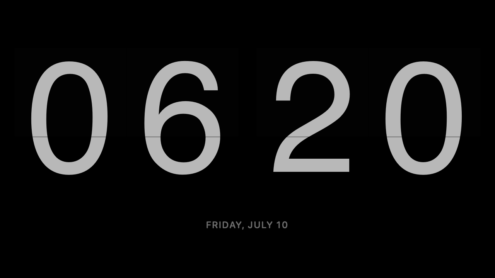
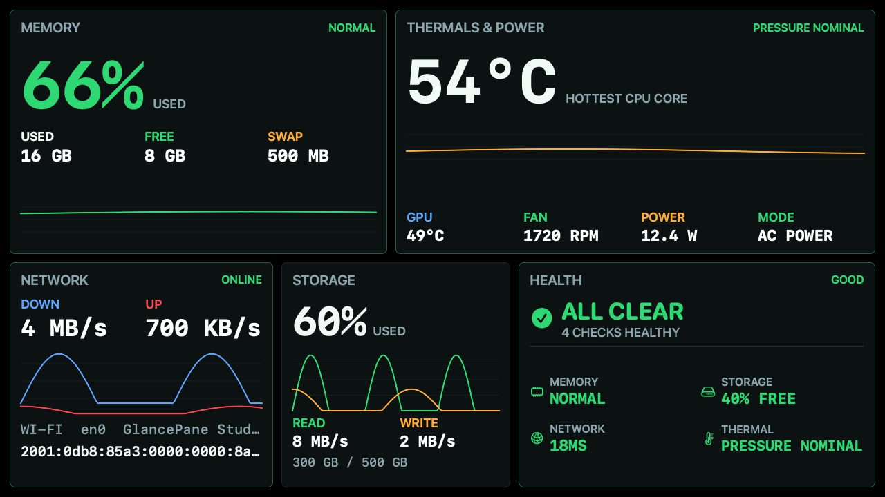
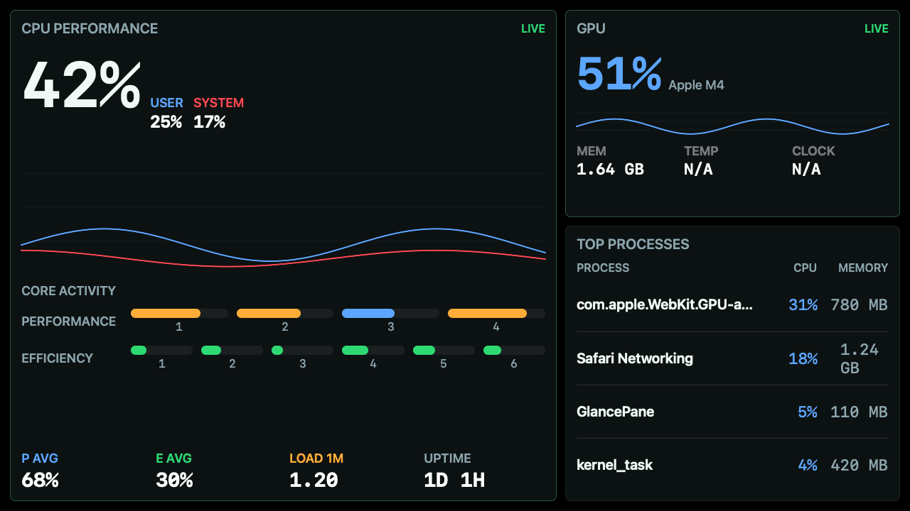
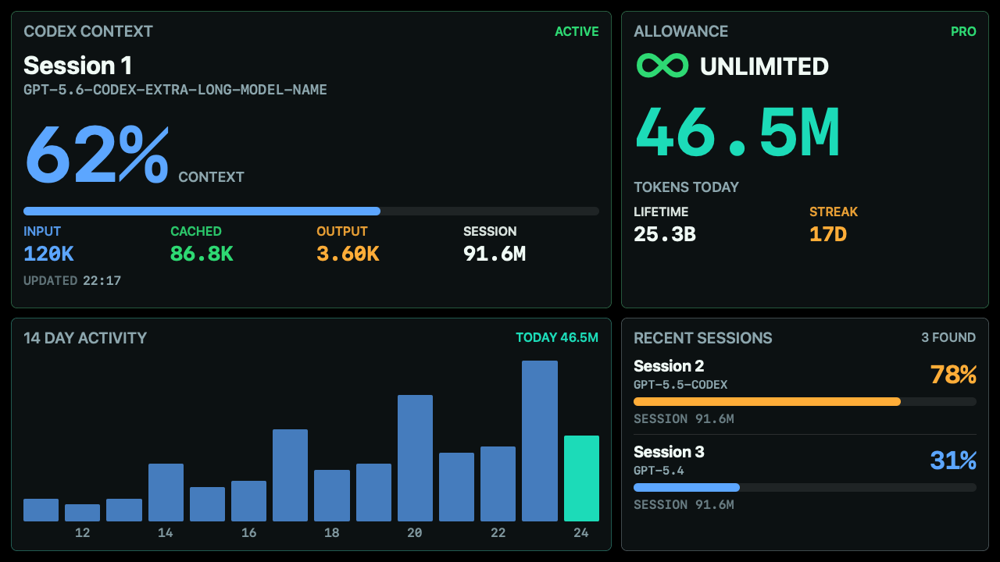
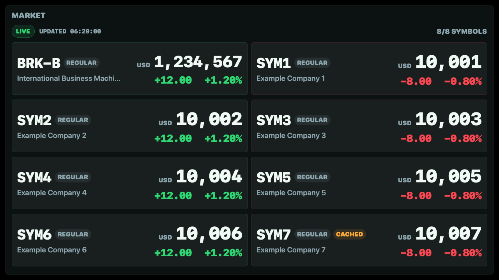
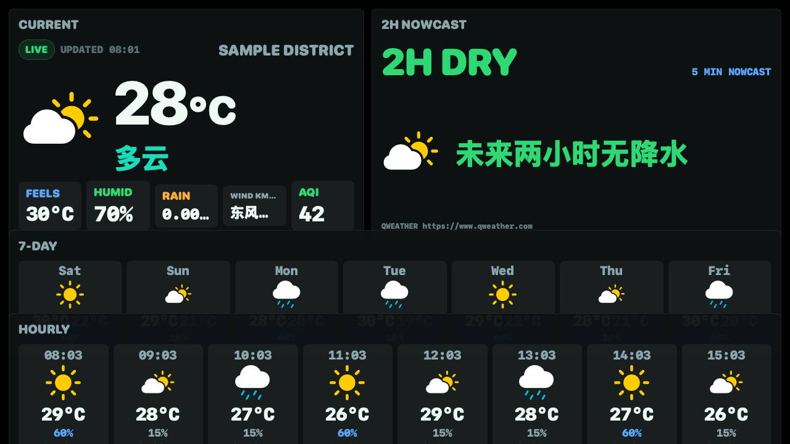

# GlancePane

[](https://github.com/danbao/GlancePane/actions/workflows/build-dmg.yml)
[](https://github.com/danbao/GlancePane/actions/workflows/gitleaks.yml)
[](https://github.com/danbao/GlancePane/releases/latest)
[](https://support.apple.com/macos)
[](https://support.apple.com/en-us/116943)
[](LICENSE)

**A glanceable, native macOS dashboard for a dedicated secondary display.**

[中文快速开始](docs/README.zh-CN.md)



GlancePane turns a small secondary monitor into a persistent status panel. It combines a split-flap clock, system health, performance history, Codex usage, market quotes, and weather in a borderless SwiftUI dashboard that stays out of your primary workspace.

## Install

GlancePane supports Apple Silicon Macs running macOS 14 or later.

1. Download `GlancePane-arm64.dmg` from the [latest release](https://github.com/danbao/GlancePane/releases/latest).
2. Open the DMG and drag `GlancePane.app` to **Applications**.
3. On first launch, Control-click the app, choose **Open**, then confirm **Open**.

The free release is ad-hoc signed but not notarized. If macOS still blocks it, open **System Settings > Privacy & Security** and allow GlancePane there. The installed app does not require Xcode, Homebrew, or this repository.

GlancePane is a menu bar app, so it does not display a Dock icon while running.

## Quick Start

1. Open the GlancePane menu bar icon and choose **Settings…**.
2. Under **Display & Behavior**, leave the target on **Automatic** to use the smallest secondary display by logical workspace size, or choose a specific monitor. GlancePane stays hidden when that display is unavailable and returns automatically when it reconnects.
3. Under **Dashboard**, enable, hide, or reorder pages and choose an optional rotation interval.

Use the left mouse button on the dashboard for the previous page and the right mouse button for the next page. Horizontal drags also switch pages. Click navigation can be disabled in Settings.

## Dashboard

### System and Performance

| System overview | Performance |
| --- | --- |
|  |  |

GlancePane displays memory pressure, storage, network activity, power, thermal state, CPU history, Apple Silicon P/E cores, GPU usage, and top processes. Sensor fields degrade to `N/A` when macOS or the hardware does not expose them.

### Agents, Market, and Weather

| Codex Agents | Market |
| --- | --- |
|  |  |



- **Agents** reads account usage from the local Codex app-server and context metadata from local session files. Project names are hidden by default.
- **Market** shows up to eight Yahoo Finance symbols with per-symbol cache fallback.
- **Weather** supports QWeather current conditions, hourly forecasts, and minute-level precipitation.

All screenshots in this README are rendered from deterministic synthetic fixtures. They contain no real account, project, network, device, or location data.

## Settings

The native Settings window manages:

- page visibility, order, and automatic rotation;
- metric groups, history, process sampling, and alert thresholds;
- themes, temperature units, and data-rate units;
- display selection, click navigation, and burn-in protection;
- Codex privacy and executable discovery;
- market symbols and QWeather credentials;
- configuration import, export, and reset.

Configuration and caches live in `~/.glancepane/`. The directory is created with mode `0700`; configuration, cache, backup, and exported configuration files use mode `0600`.

Existing GlanceDeck users should first disable the old app's **Launch at Login** option and quit it. GlancePane can then migrate supported configuration, caches, and the default QWeather private key from `~/.glancedeck/` on first launch.

## Privacy

GlancePane runs locally and does not operate a telemetry service.

- System metrics are read from macOS APIs.
- Codex prompts, responses, account email, and full project paths are not cached.
- Codex project names are hidden unless explicitly enabled.
- QWeather JWTs are generated locally from your private key and cached only in memory.
- Yahoo Finance and QWeather receive only the requests needed for their enabled pages.
- The Weather page pauses network refreshes when hidden.

See [PRIVACY.md](PRIVACY.md) for data paths and service boundaries.

## QWeather

Weather is unconfigured by default. Create an Ed25519 credential in QWeather, then generate a local key pair:

```bash
mkdir -p "$HOME/.glancepane/qweather"
chmod 700 "$HOME/.glancepane" "$HOME/.glancepane/qweather"

openssl genpkey -algorithm ED25519 \
  -out "$HOME/.glancepane/qweather/ed25519-private.pem"

openssl pkey -pubout \
  -in "$HOME/.glancepane/qweather/ed25519-private.pem" \
  -out "$HOME/.glancepane/qweather/ed25519-public.pem"

chmod 600 "$HOME/.glancepane/qweather/ed25519-private.pem"
```

Upload the public key to QWeather, then enter the API host, credential ID, project ID, private-key path, and location in GlancePane Settings. The equivalent advanced settings are stored in `~/.glancepane/config.json`.

Shell launches may override them with:

- `GLANCEPANE_QWEATHER_JWT`
- `GLANCEPANE_QWEATHER_KID`
- `GLANCEPANE_QWEATHER_PROJECT_ID`
- `GLANCEPANE_QWEATHER_PRIVATE_KEY_PATH`

## Burn-in Protection

The default strong protection mode:

- shifts the content by a few pixels;
- dims after inactivity;
- periodically shows a pure black rest screen;
- wakes when the pointer returns.

This protection changes only app content. It does not control monitor brightness or hardware sleep.

## Build and Test

```bash
sh scripts/test.sh
sh scripts/build.sh
sh scripts/package-dmg.sh
```

The DMG is written to `.build/dist/GlancePane-arm64.dmg`. The test runner uses temporary directories, synthetic HTTP responses, and offscreen `1280×720` rendering. It does not access live QWeather or Yahoo Finance APIs.

Regenerate the public screenshots with:

```bash
sh scripts/export-readme-screenshots.sh
```

## Development

Run the app detached from the terminal:

```bash
sh scripts/run-detached.sh
```

After code changes:

```bash
sh scripts/restart.sh
```

Inspect unified logs with:

```bash
sh scripts/logs.sh
sh scripts/logs.sh --follow
```

See [CONTRIBUTING.md](CONTRIBUTING.md) before opening a pull request. Security reports should follow [SECURITY.md](SECURITY.md).

## License

GlancePane is available under the [MIT License](LICENSE). Oswald is bundled under the SIL Open Font License. The SMC implementation is informed by the MIT-licensed Stats project; see [THIRD_PARTY_NOTICES.md](THIRD_PARTY_NOTICES.md).
